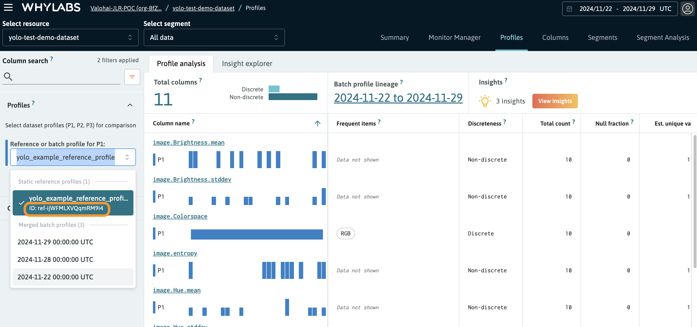

# Loading a Reference Profile from WhyLabs

This guide explains how to use the `load_reference_data_from_whylabs` function in your project to load a reference profile from WhyLabs. The function fetches the profile using the WhyLabs API and provides it as a `DatasetProfileView` object for use in data validation and monitoring.

---

## Prerequisites

### 1. Environment Variables
To use the function, you need to set the following environment variables:

- `WHYLABS_DEFAULT_ORG_ID`: Your WhyLabs organization ID.
- `WHYLABS_DEFAULT_DATASET_ID`: Your WhyLabs dataset (model) ID.
- `WHYLABS_API_KEY`: Your WhyLabs API key for authentication.
- `WHYLABS_REF_ID`: The unique reference profile ID.

`WHYLABS_API_KEY`
1. Go to the WhyLabs Hub.
2. Navigate to Menu → Settings → Manage API tokens.
3. Create or copy an API token for use in your project.

`WHYLABS_REF_ID`
1. Open your WhyLabs Dashboard.
2. Locate the reference profile you want to use.
3. Refer to the screenshot below:



For more information about working with environment variables in Valohai, refer to the [Valohai Environment Variables Documentation](https://docs.valohai.com/hc/en-us/articles/18704316176017-Environment-Variables).

### 2. Install Required Dependencies
Ensure the following libraries are installed:
```bash
pip install whylabs-client whylogs
```

### 3. Specify the Inference Step Parameter
When running the inference step, specify the `use_whylabs_reference_profile` parameter:
- **`use_whylabs_reference_profile`**: Indicates whether to load the reference profile from WhyLabs. If set to `False`, the reference profile will be created dynamically using the input data provided in the `ref_data` directory.

---

## Function Explanation

The `load_reference_data_from_whylabs` function performs the following steps:

1. **Environment Variable Loading**:
   - The function retrieves `ORG_ID`, `MODEL_ID`, `API_KEY`, and `REF_ID` from the environment. If any are missing, it raises an error.

2. **API Client Configuration**:
   - Configures the WhyLabs API client using `whylabs_client.Configuration`. The API key is used for authentication.

3. **Fetching Metadata**:
   - Calls `get_reference_profile` from `DatasetProfileApi` to retrieve metadata for the reference profile.

4. **Downloading the Profile**:
   - Uses the `download_url` from the API response to fetch the reference profile as binary data.

5. **Deserializing the Profile**:
   - Converts the binary data into a `DatasetProfileView` object using `whylogs.DatasetProfileView.deserialize`.

6. **Returning the Profile**:
   - The function returns the `reference_profile`, ready for use in your pipeline.

---

## References

1. **WhyLabs Documentation**:
   - For more details on managing profiles in WhyLabs, see the [WhyLabs Documentation](https://docs.whylabs.ai/docs/overview-profiles).

2. **WhyLabs Python Client**:
   - Learn more about the `get_reference_profile` API in the [WhyLabs Python Client GitHub Documentation](https://github.com/whylabs/whylabs-client-python/blob/mainline/docs/DatasetProfileApi.md#get_reference_profile).

3. **Valohai Environment Variables**:
   - Learn how to manage environment variables in Valohai from the [official documentation](https://docs.valohai.com/hc/en-us/articles/18704316176017-Environment-Variables).

---

## Example Usage

```python
from your_project_module import load_reference_data_from_whylabs

# Ensure the required environment variables are set
reference_profile = load_reference_data_from_whylabs()
print(f"Successfully loaded reference profile with timestamp: {reference_profile.dataset_timestamp}")
```
When running inference, use the `use_whylabs_reference_profile` parameter to specify whether the reference profile is loaded from WhyLabs. You can adjust this parameter in the `valohai.yaml` file or through the Valohai UI.

