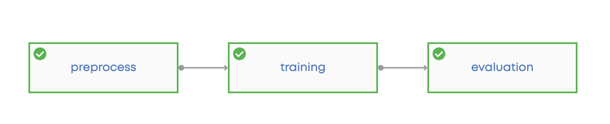
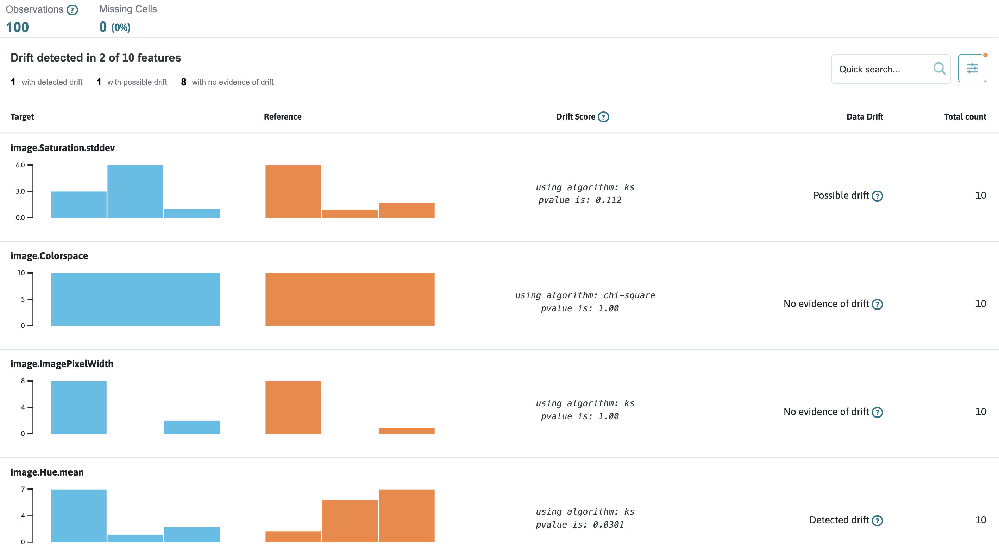
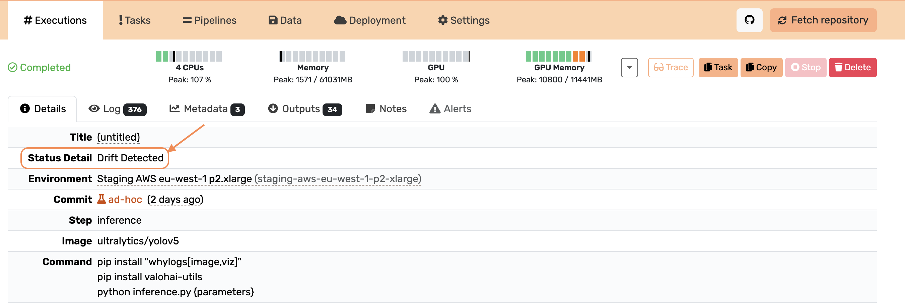
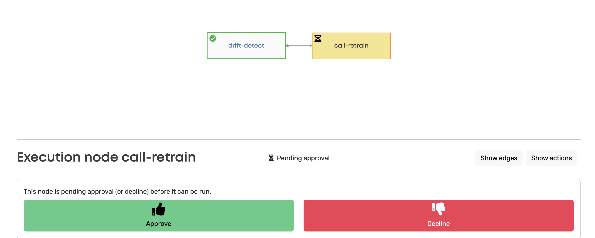
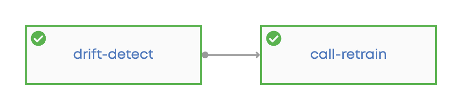
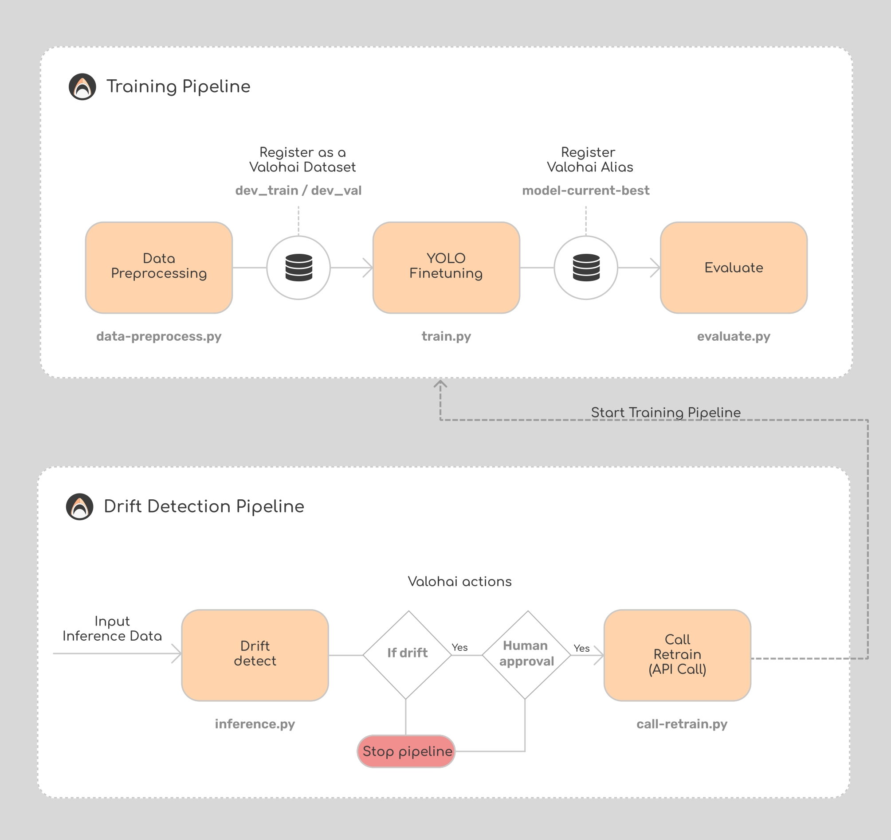

# Drift Detection using WhyLabs

This repository is made to show one of the ways how to detect the data drift when using [Valohai](https://app.valohai.com/).
Here, we use [WhyLabs](https://whylabs.ai/) to generate drift reports for the input image data. We also show how to automaticaly trigger the retraining of the model, how to use human approval to the step in the pipeline, how to use Valohai actions.

👉 **Watch this video** for a detailed explanation of the Valohai x WhyLabs integration: [Loom Video](https://www.loom.com/share/d9b02b23c27b46b8931200724606bec6?sid=96a459b4-5bc9-4800-ba6b-e8a69fdf28fd)

## Drift is..

Drift in machine learning refers to a change over time in input data or the relationship between input and output data, impacting model performance. Drift can lead to reduced model accuracy as the model becomes less effective over time, necessitating regular updates.

### Training pipeline

Basic Pipeline that preprocess the data, trains the model and evaluates the results.

Consists of three steps:

- Data Preprocessing:
  1. Load compressed data from S3 bucket
  2. Preprocess images
  3. Save to Valohai datasets
- YOLO finetuning:
  1. Create yaml file with data path - readable to YOLO
  2. Train yolo using library `ultralytics`
  3. Save best model with Valohai alias.
- Evaluation:
  1. Load and evaluate the model using `ultralytics`
  2. Save the results to Valohai.

Training Pipeline view in Valohai:

<p align="center">

</p>

### Drift detection pipeline

Does the inference of the fine-tuned model and detects the data drift using [WhyLabs](https://whylabs.ai/).

Consists of two steps:

- Drift detection:
  1. Load the data and the model
  2. Inference the data
  3. Log the data to WhyLabs
  4. Create inference and reference (from train data) profiles
  5. Generate summary drift report with WhyLabs in html (`summary_drift_report.html`)
     <p align="center"></p>
     _Note: We set a threshold on the number of image characteristics showing drift in WhyLabs. Once this threshold is reached, we initiate the training pipeline._
  6. If drift is detected, change Status detail. <p align="center"></p>
  7. if drift is not detected, then the pipeline is stopped ([Valohai actions docs](https://docs.valohai.com/hc/en-us/articles/18704272477841-Conditions), see `valohai.yaml` -> `drift-detection-pipeline`)
- Call retrain
  1. Only if on the previous step the drift was detected, the node starts.
  2. When the node is starting it will require human approval ([Valohai actions docs](https://docs.valohai.com/hc/en-us/articles/18704272477841-Conditions)) <p align="center"></p>
     - You can set up notification when the pipeline requires human approval by going: project `Settings -> Notifications -> pipeline node approval required`.
  3. If approved, API call to start the `Training Pipeline` - retrain the model because the drift was detected.

Drift Detection Pipeline view in Valohai:

<p align="center">

</p>

Overall flow of the project:

<p align="center">

</p>

## Running on Valohai

### Configure the repository:

To run your code on Valohai using the terminal, follow these steps:

1. Install Valohai on your machine by running the following command:

```bash
pip install valohai-cli valohai-utils
```

2. Log in to Valohai from the terminal using the command:

```bash
vh login
```

3. Create a project for your Valohai workflow.

Start by creating a directory for your project:

```bash
mkdir valohai-drift-example
cd valohai-drift-example
```

Then, create the Valohai project:

```bash
vh project create
```

4. Clone the repository to your local machine:

```bash
git clone https://github.com/valohai/drift-example.git .
```

Congratulations! You have successfully cloned the repository, and you can now modify the code and run it using Valohai.

### Running Executions:

To run individual steps, execute the following command:

```bash
vh execution run <step-name> --adhoc
```

For example, to run the prepare_data step, use the command:

```bash
vh execution run prepare_data --adhoc
```

### Running Pipelines:

To run pipelines, use the following command:

```bash
vh pipeline run <pipeline-name> --adhoc
```

For example, to run the three-trainings-pipeline-w-deployment pipeline, use the command:

```bash
vh pipeline run train-val-pipeline --adhoc
```

## FAQ

### 1. Working with secrets.

In this project you need to use private tokens in two places: to use WhyLabs and to use Valohai API in `call-retrain.py`.

Note that you should never include the token in your version control. Instead of pasting it directly into your code, we recommend storing it as a secret environment variable.

You can add environment variables in a couple of ways in Valohai.

- Add the environment variable when creating an execution from the UI (Create Execution -> Environment Variables). The env variable are only available in the execution where it was created.
- Add the project environment variable (Project Settings -> "Environment Variables" tab -> Check "Secret" checkbox). In this case, the env variable will be available for all executions of the project.

### 2. Other monitoring tools.

WhyLabs is presented here as one of the options to detect the data drift for the image data. Valohai does not have limitations for any other monitoring tools like EvidentlyAI, Fiddler, Censius, NeptuneAI etc.
